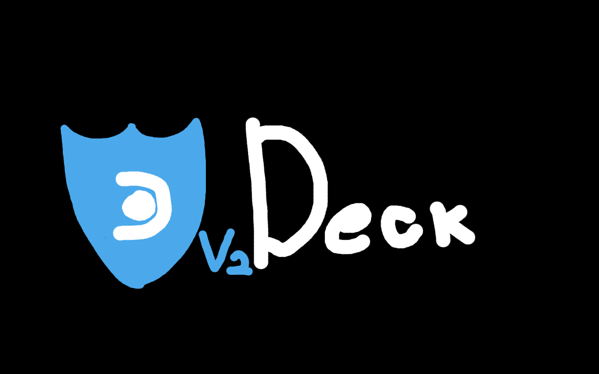

# v2deck

VPN client for Steam Deck based on VLESS protocol.



## Features

- VLESS protocol with all transports (TCP, WebSocket, gRPC, HTTP/2, QUIC, mKCP)
- Security: Reality, TLS, None
- TUN mode - routes all traffic through VPN (best for games)
- System proxy mode
- Nerd Stuff - advanced settings for power users

## Supported Transports

| Transport   | Status |
| ----------- | ------ |
| TCP         | ✅     |
| WebSocket   | ✅     |
| gRPC        | ✅     |
| HTTP/2      | ✅     |
| QUIC        | ✅     |
| mKCP        | ✅     |
| HTTPUpgrade | ✅     |
| SplitHTTP   | ✅     |

## Requirements

- Steam Deck with [Decky Loader](https://decky.xyz)
- VLESS server

## Installation

### From Decky Store (Recommended)

1. Open Decky Loader in Gaming Mode
2. Go to Store
3. Search "v2deck"
4. Install

### Manual Installation

```bash
# Clone repo
git clone https://github.com/imaginatorone/v2deck.git
cd v2deck

# Build & Install
chmod +x build.sh install.sh
./build.sh
./install.sh

# Restart Steam
sudo systemctl restart plugin_loader
```

## Usage

1. Get VLESS URL from your VPN provider or app (v2rayNG, Nekobox, etc.)
2. Send URL to Steam Deck via Steam Chat, email, or paste service
3. In Gaming Mode: open Decky > v2deck > Add Profile
4. Paste URL and import
5. Connect

## Nerd Stuff (Advanced Settings)

- Connection mode (TUN/Proxy)
- Custom ports (SOCKS/HTTP)
- TUN MTU
- DNS server
- Log level
- Domain strategy
- Block ads
- Bypass LAN/China
- Allow insecure TLS
- Mux settings

## Troubleshooting

**Plugin not showing:** Check Decky Loader is installed (`ls ~/homebrew/plugins/`)

**xray not found:** Run `./install.sh` to download binaries

**Connection fails:** Check View Logs in Settings, verify your server is working

## License

MIT License

Copyright (c) 2026 imaginatorone
